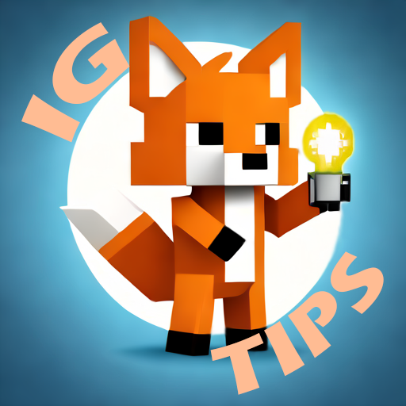

  
   
  Logo Made By <a href="https://github.com/Zarinoow">Zarinoow</a>

# InGameTips
[![CC BY-NC-ND 4.0][cc-by-nc-nd-shield]][cc-by-nc-nd]

# Terms of Use

- My mod is **public** and **free** to use, please **be respectful** of my work.
- The code of my mod is open to anyone who is interested to learn more about programming. It is **__under no circumstances tolerated to copy or steal my code__** without my prior consent!
- You can contribute to the project by creating a pull request, but it **is not guaranteed that it will be accepted**.
- Is it forbidden to distribute my mod on other platforms without my consent.
- You **can't use my mod for commercial purposes** without my consent.
- I have no obligation to maintain this project, it is free and takes my own time, thank you for understanding.
- Have fun using it!

 This work is licensed under a [Creative Commons Attribution-NonCommercial-NoDerivs 4.0 International License][cc-by-nc-nd].

[![CC BY-NC-ND 4.0][cc-by-nc-nd-image]][cc-by-nc-nd]

[cc-by-nc-nd]: http://creativecommons.org/licenses/by-nc-nd/4.0/
[cc-by-nc-nd-image]: https://licensebuttons.net/l/by-nc-nd/4.0/88x31.png
[cc-by-nc-nd-shield]: https://img.shields.io/badge/License-CC%20BY--NC--ND%204.0-lightgrey.svg