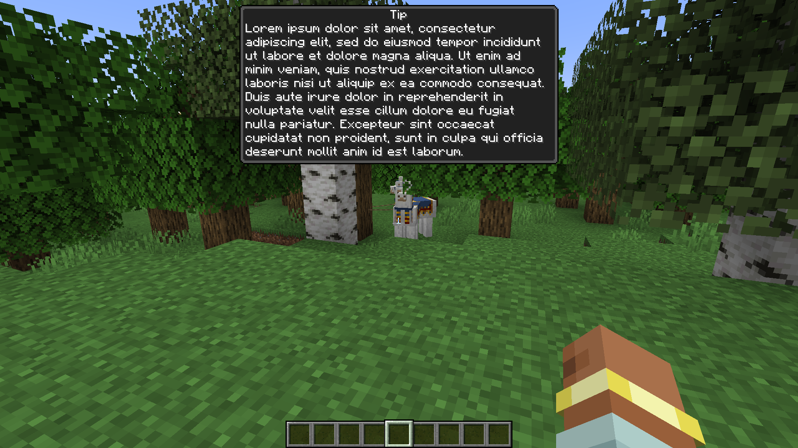

  
   
  Logo Made By <a href="https://github.com/Zarinoow">Zarinoow</a>

# InGameTips
[![CC BY-NC-ND 4.0][cc-by-nc-nd-shield]][cc-by-nc-nd]

InGameTips is a vanilla friendly mod that allows you to display tips directly in the game. The mod is highly customizable and allows you to create, schedule and disable tips. Tips are server-sided and can be displayed to all players on the server with the mod installed.
  This mod is very useful for **server owners**, **mod makers** or **modpack creators** who want to facilitate the understanding of their content.

  

# Features :

| Feature | Description                                                                                                                                                                                                                                                              |
| --- |--------------------------------------------------------------------------------------------------------------------------------------------------------------------------------------------------------------------------------------------------------------------------|
| Server-Sided | Server-sided tips are very useful for server owners. You can connect to different servers and receive tips from each server. If you want add tips to your server, you can do it easily without any client-side modifications. You can also control when a user receives a tip. |
| Import from Datapack | You can import tips from a data pack. This feature is very useful for modpack creators who want to add tips to their modpack. You can also create a data pack with tips and share it publicly.                                                                           |
| Import from Mod | You can import tips from a mod. This feature is very useful for mod makers who want to add tips to help players understand their mod.                                                                                                                                    |
| Scheduled Tips | You can schedule tips to be displayed at a specific time. This feature is highly customizable and allows you to create a schedule for each tip. You can also disable the schedule at any time.                                                                           |
| Tips Synchronization | Tips are synchronized by the server. This feature allows you to synchronize the schedule between all players. You can send same or different tips to each player at the same time.                                                                                       |
| Localized Tips | Tips can be localized. This feature allows you to send tips in different languages. You can also send tips to players who speak a specific language.                                                                                                                     |
| Localized Mod | The mod actually supports multiple languages. Currently, the mod is available in English, German, Spanish, Italian, French and Occitan. You can also add your own language by creating a pull request.                                                                                                     |
| Client Configuration | The mod has a client configuration. This feature allows you to enable or disable tips. You can also disable the sound of the tips and the maximum displayed lines.                                                                                                          |
| Tip Memory | The mod has a tip memory. This feature prevents the player from receiving the same tip multiple times.                                                                                                                              |
| Tip Recyling | The mod has a tip recycling system. This feature allows you to display tips in a loop. When all tips have been displayed, the tip memory will be reset and the tips will be displayed again.                                                                              |
| Command | The mod has a command. This feature allows you to display tips manually. You can display tips to a specific player or to all players.                                                                                                                                    |

# Supported Minecraft Versions :

| Minecraft Version | Forge   | Fabric | 🦊 Neo Forge | Quilt | Other |
|-------------------|---------| --- |--------------| --- |-------|
| 1.21              | 🔴      | ❌ | ❌           | ❌ | 🔴    |
| 1.20.2 - 1.20.4   | 🔴 | ❌ | ❌ | ❌ | 🔴     |
| 1.20.1            | ✅ 1.0.0 | 👀 | 🤔 1.0.0     | 👀 | 🔴     |
| 1.20              | ❌| ❌ | 🔴    | ❌ | 🔴     |
| 1.19 - 1.19.4     | ❌ | ❌ | 🔴 | ❌ | 🔴     |
| 1.18 - 1.18.2     | ❌ | ❌ | 🔴     | ❌ | 🔴     |
| 1.17 - 1.17.1     | ❌ | ❌ | 🔴     | ❌ | 🔴     |
| 1.16 - 1.16.5     | ❌ | ❌ | 🔴    | ❌ | 🔴     |
| 1.13 - 1.15.2     | 🔴 | 🔴 | 🔴     | 🔴 | 🔴     |
| 1.12 - 1.12.2     | 🔴 | 🔴 | 🔴     | 🔴 | 🔴     |
| 1.7.10            | 🔴 | 🔴 | 🔴     | 🔴 | 🔴     |

✅ : Supported, ❌ : Unsupported but planned, 🔴 : Unsupported and not planned, 🤔 : Not tested, 👀 WIP : Work In Progress
 
# Frequently Asked Questions :

## Can I use this mod in my modpack ?

Yes, you can use this mod in your modpack unless you respect the [terms of use](#Terms-of-Use).

## How can I add tips to my modpack ?

### I'am a server owner :
Create a data pack with the tips you want to add. After that, you just need to drop the data pack in the `datapacks` folder of your server (Usually located in the main world folder). For detailed steps, you can check the [wiki](https://github.com/FoxeliaFR/InGameTips/wiki/Server).

### I'am a modpack creator :
Like a server owner, you can create a data pack with the tips you want to add. You can also include tips by adding a mod that supports the tips system. For detailed steps to create a data pack, you can check the [wiki](https://github.com/FoxeliaFR/InGameTips/wiki/Modpack).

### I'am a mod maker :
To embed tips in your mod you don't need to depend on any mod. You simply need to add some files to your assets folder. For detailed steps, you can check the [wiki](https://github.com/FoxeliaFR/InGameTips/wiki/Mod).

## I have a problem with the mod, how can I report it ?
To report a problem with the mod, you can create an issue on the [GitHub repository](https://github.com/FoxeliaFR/InGameTips/issues). Please provide as much information as possible to help me understand the problem.

## I have an idea for the mod, how can I suggest it ?
To suggest an idea for the mod, you can create an issue on the [GitHub repository](https://github.com/FoxeliaFR/InGameTips/issues). Please provide as much information as possible to help me understand the idea.

## Can you backport the mod to an older version ?
I don't plan to backport the mod to legacy minecraft versions. As the mod is datapack based, backporting the mod would be very difficult and time consuming. However, you can create a pull request to backport the mod to an older version, but I will not provide any support or updates for it.

## When do you plan to release the next version ?
I don't have a specific release date for the next version. I work on the mod in my free time and I don't have a specific schedule. However, you can check the [GitHub repository](https://github.com/FoxeliaFR/InGameTips/releases) to see the latest releases.

## I need help with the mod, how can I get help ?
You can join the [Zarinoow Development Discord](https://discord.gg/Ny28nkh4Fj) for international support. You can also join the [Foxelia Development Discord](https://discord.foxelia.fr/) for french support and follow our other projects.

# Ideas for future versions :
- Add support for Fabric
- Support more Minecraft versions
- Custom background for tips
- Custom API to trigger tips on specific events
- Skip tips with a key
- Elapsed time bar
- Spigot version

# Server, Modpack and Mod who use InGameTips :
- None

🛜 : Server, 🍵 : Mod, 🗂️ : Modpack

# Get support :

**Discord :** https://discord.gg/Ny28nkh4Fj

# Terms of Use

- My mod is **public** and **free** to use, please **be respectful** of my work.
- The code of my mod is open to anyone who is interested to learn more about programming. It is **__under no circumstances tolerated to copy or steal my code__** without my prior consent!
- You can contribute to the project by creating a pull request, but it **is not guaranteed that it will be accepted**.
- Is it forbidden to distribute my mod on other platforms without my consent.
- You **can't use my mod for commercial purposes** without my consent.
- I have no obligation to maintain this project, it is free and takes my own time, thank you for understanding.
- Have fun using it!

 This work is licensed under a [Creative Commons Attribution-NonCommercial-NoDerivs 4.0 International License][cc-by-nc-nd].

[![CC BY-NC-ND 4.0][cc-by-nc-nd-image]][cc-by-nc-nd]

[cc-by-nc-nd]: http://creativecommons.org/licenses/by-nc-nd/4.0/
[cc-by-nc-nd-image]: https://licensebuttons.net/l/by-nc-nd/4.0/88x31.png
[cc-by-nc-nd-shield]: https://img.shields.io/badge/License-CC%20BY--NC--ND%204.0-lightgrey.svg